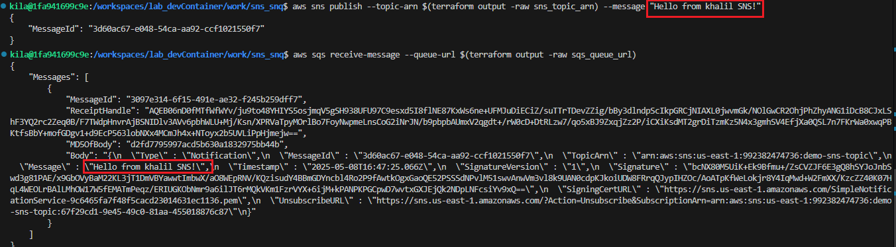

# AWS SQS & SNS Demo with Terraform

## Overview
This guide demonstrates how to use Terraform to:
1. Create an SNS topic and SQS queue in AWS
2. Subscribe the queue to the topic
3. Publish and consume messages



*Figure 1: Screenshot of the successful demo showing message flow from SNS to SQS*

## Prerequisites
- AWS account with CLI configured (`aws configure`)
- Terraform installed
- Git (optional)

## Step 1: Clone or Create the Terraform Files

```bash
mkdir aws-sns-sqs-demo
cd aws-sns-sqs-demo
```

Create `main.tf` with the following content:

```hcl
provider "aws" {
  region = "us-east-1"
}

resource "aws_sns_topic" "demo_topic" {
  name = "demo-sns-topic"
}

resource "aws_sqs_queue" "demo_queue" {
  name = "demo-sqs-queue"
}

resource "aws_sns_topic_subscription" "topic_subscription" {
  topic_arn = aws_sns_topic.demo_topic.arn
  protocol  = "sqs"
  endpoint  = aws_sqs_queue.demo_queue.arn
}

resource "aws_sqs_queue_policy" "demo_queue_policy" {
  queue_url = aws_sqs_queue.demo_queue.id

  policy = jsonencode({
    Version = "2012-10-17",
    Statement = [
      {
        Effect    = "Allow",
        Principal = "*",
        Action    = "sqs:SendMessage",
        Resource  = aws_sqs_queue.demo_queue.arn,
        Condition = {
          ArnEquals = {
            "aws:SourceArn" = aws_sns_topic.demo_topic.arn
          }
        }
      }
    ]
  })
}

output "sns_topic_arn" {
  value = aws_sns_topic.demo_topic.arn
}

output "sqs_queue_url" {
  value = aws_sqs_queue.demo_queue.url
}
```

## Step 2: Initialize and Apply Terraform

```bash
terraform init
terraform apply
```

Review the plan and type `yes` when prompted to create the resources.

## Step 3: Send a Test Message

Use the AWS CLI to publish a message to your SNS topic:

```bash
aws sns publish --topic-arn $(terraform output -raw sns_topic_arn) --message "Hello from SNS!"
```

## Step 4: Receive Messages from Queue

Check for messages in your SQS queue:

```bash
aws sqs receive-message --queue-url $(terraform output -raw sqs_queue_url)
```

Expected output:
```json
{
    "Messages": [
        {
            "MessageId": "...",
            "ReceiptHandle": "...",
            "MD5OfBody": "...",
            "Body": "Hello from SNS!"
        }
    ]
}
```

## Visual Demonstration

After running the above commands, you should see results similar to this:


*Figure 2: Terminal output showing successful message transmission*

## Step 5: Clean Up Resources

When finished, destroy all resources to avoid unnecessary charges:

```bash
terraform destroy
```

Type `yes` when prompted to confirm deletion.

## Troubleshooting

1. **AWS CLI not configured**: Run `aws configure` and enter your credentials
2. **Permissions errors**: Verify your IAM user has proper permissions
3. **Terraform errors**: Check AWS service limits in your region
4. **Screenshot not appearing**: Ensure `sqs_sns.png` is in the same directory as this guide

## Additional Demonstrations (Optional)

- Show multiple subscribers by creating a second queue
- Demonstrate message filtering by adding subscription filters
- Show dead-letter queue configuration for error handling

## Resources

- [AWS SNS Documentation](https://docs.aws.amazon.com/sns/latest/dg/welcome.html)
- [AWS SQS Documentation](https://docs.aws.amazon.com/AWSSimpleQueueService/latest/SQSDeveloperGuide/welcome.html)
- [Terraform AWS Provider](https://registry.terraform.io/providers/hashicorp/aws/latest/docs)
